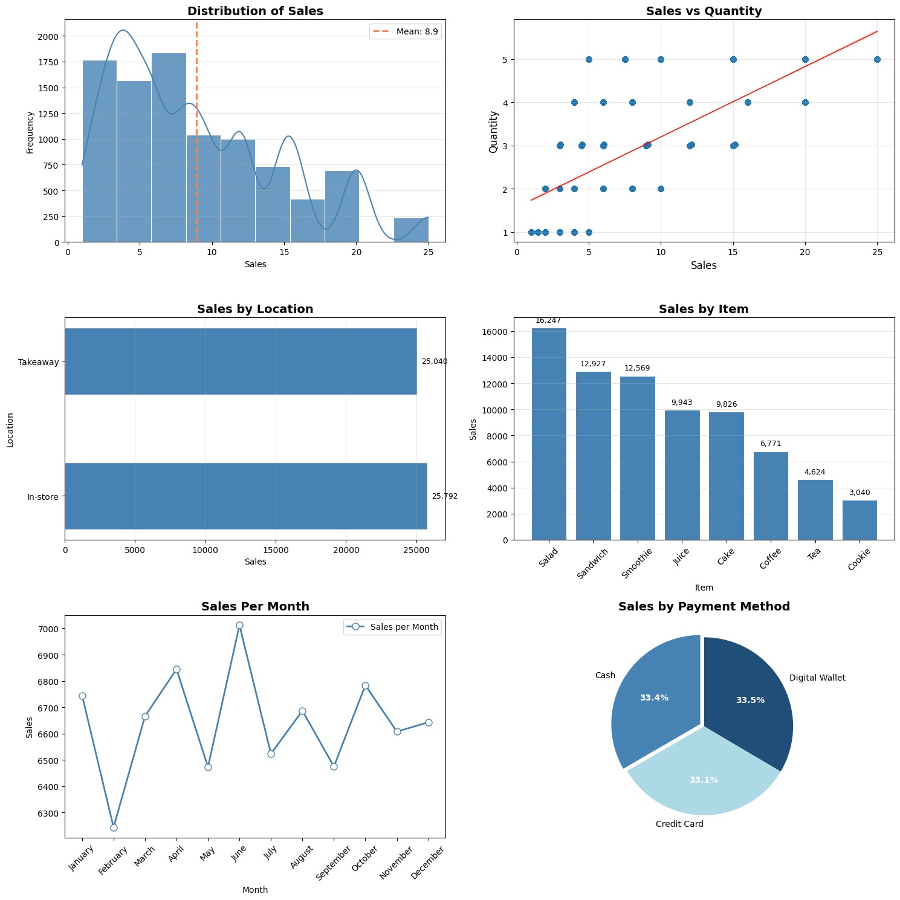

# Cafe Sales Data Analysis

Step-by-step data cleaning and exploratory data analysis (EDA) of a 10,000-transaction cafe sales dataset, performed in Python.

## Project Overview

The raw dataset was deliberately "dirty": every column contained a mix of valid entries and placeholder junk values (`"UNKNOWN"`, `"ERROR"`), and every column was typed as generic text instead of proper numeric or date types.

This project simulates a realistic analyst workflow:
- Assess data quality before touching a single value
- Design and apply a transparent, reproducible cleaning pipeline
- Explore each variable individually before looking at relationships
- Extract sales, product, location, payment, and time-based insights
- Translate findings into business-relevant recommendations

## Tools

- Python 3 (Pandas, NumPy)
- Matplotlib, Seaborn
- Google Colab

## Key Results

| Metric | Value |
|---|---|
| Total Revenue | 82,900.80 |
| Average Transaction Value | 8.93 |
| Valid Transactions Analyzed | 9,475 / 10,000 |
| Top Revenue Item | Salad (16,247) |
| Best-Selling Item by Volume | Coffee (1,132 orders) |
| Quantity ↔ Total Spent Correlation | r = 0.70 |

## Key Insights

- **Salad** is the top revenue-generating item, while **Coffee** is the most frequently ordered — but ranks only 6th in total revenue, suggesting its pricing could be revisited.
- Revenue is nearly evenly split between **In-store** and **Takeaway**, and across all three **payment methods** (~33% each).
- **June** recorded the highest monthly sales and **February** the lowest; the rest of the year is fairly stable.
- No customer identifier exists in the dataset, which limits any customer-level segmentation — noted as a key limitation.

## Repository Contents

- `cafe_sales_analysis.py` — full cleaning and analysis script
- `Cafe_Sales_Full_Analysis_Report.pdf` — complete 10-page report (methodology, data quality assessment, univariate/bivariate analysis, insights, limitations, recommendations)
- `dashboard.jpg` — final 6-chart visual summary

## Author

**Feriel** — Data Analyst
[LinkedIn](#) · [Portfolio](#)
